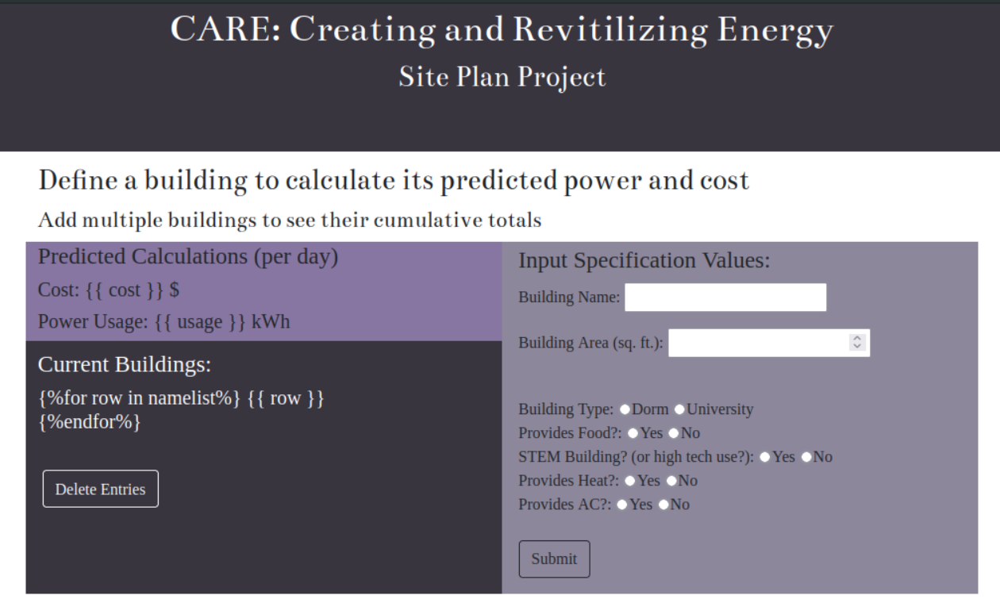
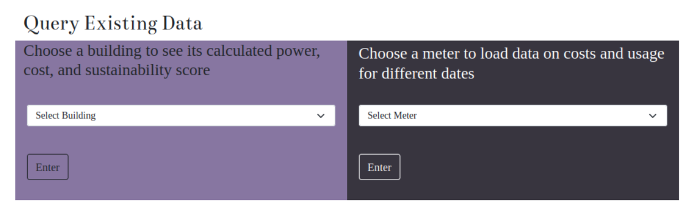
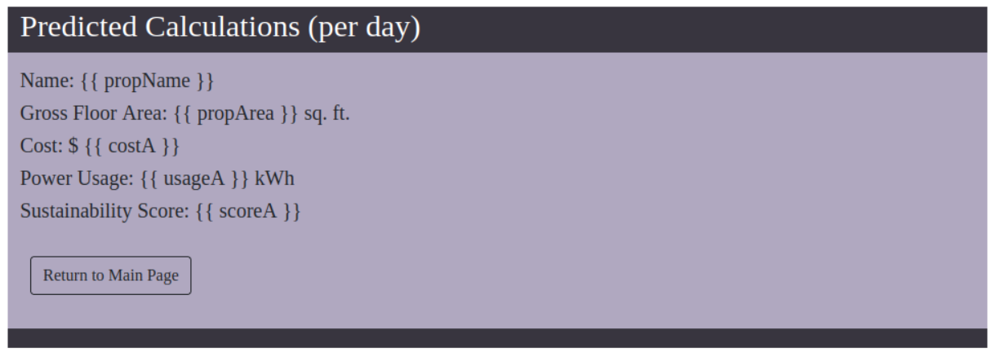
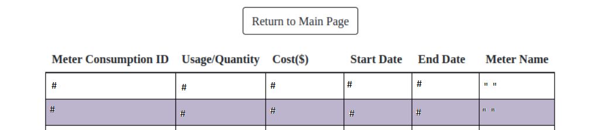

## Overview

This application has two functionalities in future planning for energy cost and energy use. 
The first is to create a plan for future buildings using calculations to predict their use and cost based on their attributes.
The second is to allow users to compare old buildings by querying information from the database.
Together, these functionalites will aid in smart planning for the future with sustainability in mind.

## One-Time Installation

```
# install python pip and psycopg2 packages
sudo pacman -Syu
sudo pacman -S python-pip python-psycopg2

# install flask
pip install flask
```

## Usage

To run the Flask application, execute:

```
export FLASK_APP=app.py
flask run
# then browse to http://127.0.0.1:5000/
```

The site plan can be made by inputting attributes about a potential new building. The projected cost and usage will be caluclated as a cumulative total for all buildings entered. Calculations are performed with a model made based off the database information. 
Queries from the database can be made using the dropdown features. 

The files needed to use this application consits of data for buildings on a property, the meters tracking energy, and the meter entries. Once a database is made with these 3 relations, connect to it and run the application.

## Screenshots





## References

Flask documentation:  
https://flask.palletsprojects.com/  

Psycopg2 documentation:  
https://www.psycopg.org/  
